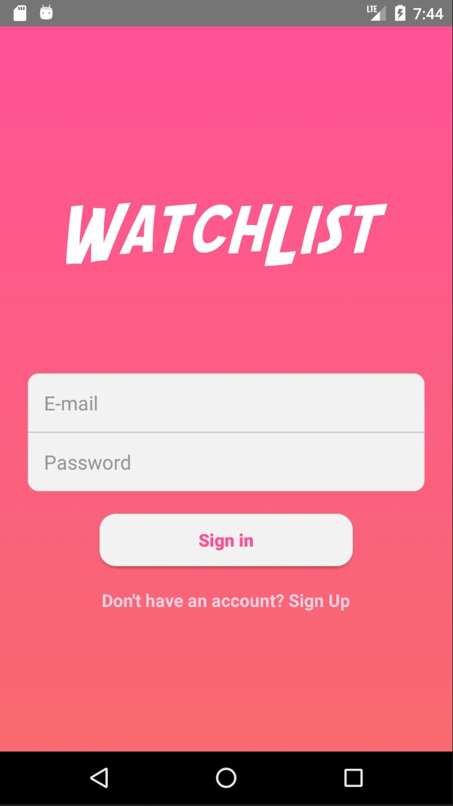
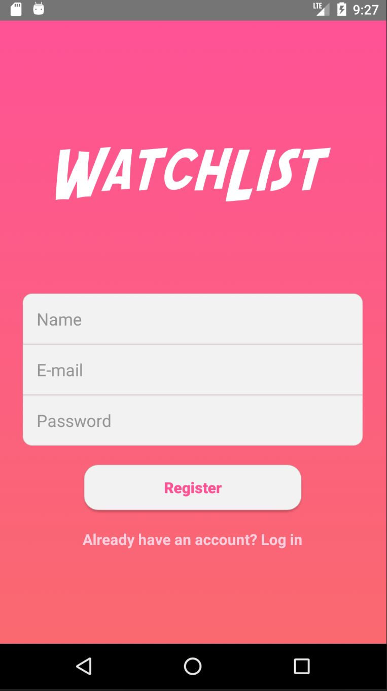
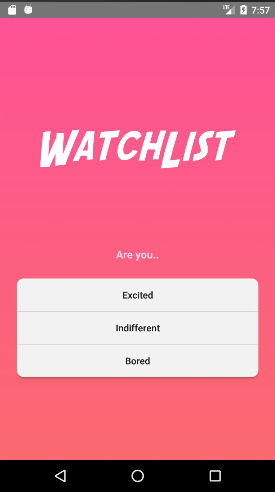
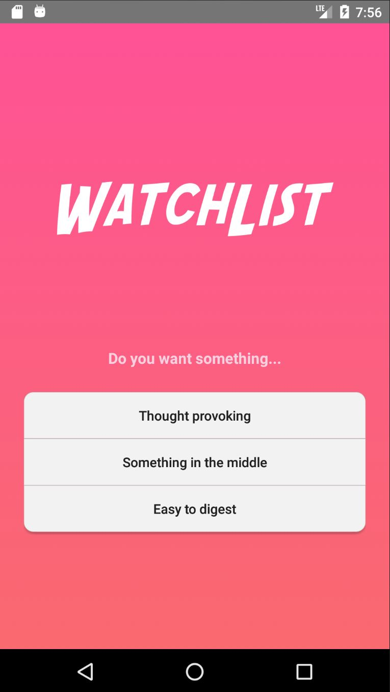
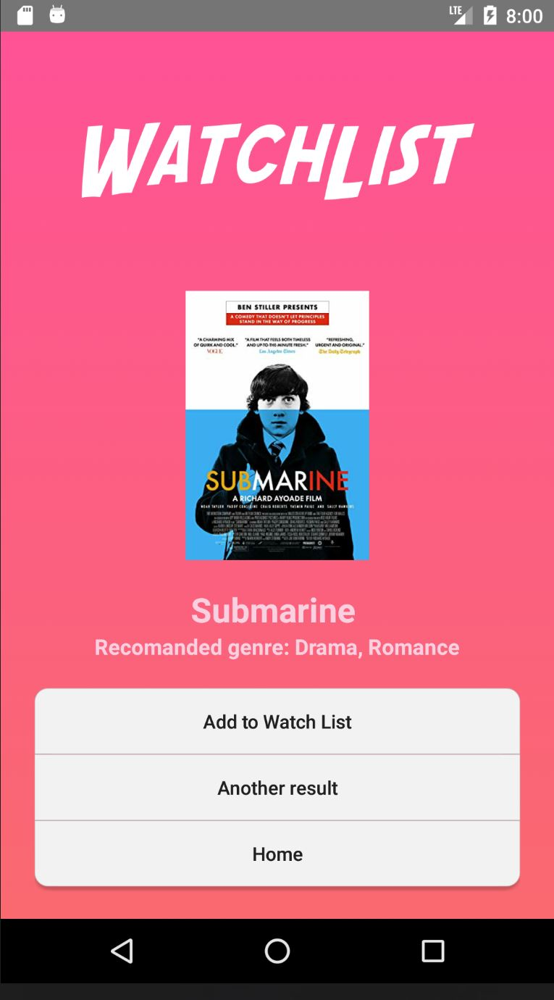
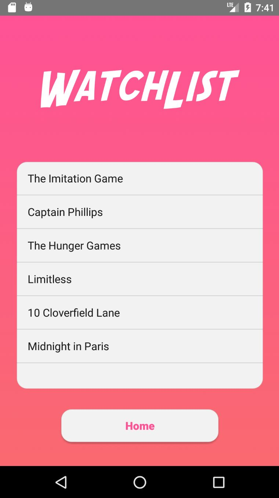
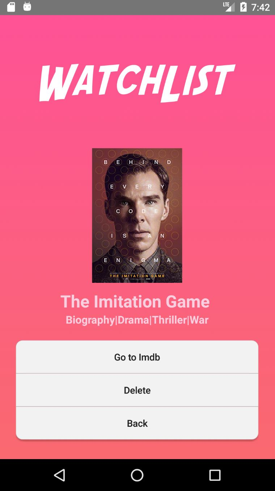

# Watchlist

### Main idea

The concept behind the app is to eliminate the time wasted searching for a **movie which is in tone with your current mood**. In order to do that the app has a small quiz which tries to find the perfect genres for you and after that it gives you a series of movies to choose from.

### Authentication

The sign up/login process is done using Google Firebase Authentication with the user's email. Apart from the authentication an instance is created in the database containing the user email, name and list of titles from his watchlist (initially empty, here are stored the ids of movies from the movie database).

### Quiz

The main ideea here is to find the right movie for your state of mind. (for ex: if a person had a bad day than a comedy will be more likely to cheer him up making him feel better than watching a WW2 drama or ...Hachiko). Here every genre will have a score which will be incremented based on the user answers, in the end the app will search for a movie which belongs to the desired genre/s (the one with most points if the first positioned genre is above all with at least 2 points otherwise the first 2 genres with most points). The titles will be fetched from the Firebase database with all the info except the poster which is got from the OMDB API.

    Questions:
    
	How was your day?
	Good ++drama +thriller
	Ok ++action ++romance
	Bad ++comedy

	Do you want something...
	Thought provoking +++drama 
	Something in the middle +action ++thriller
	Easy to digest +romance +++comedy

	Are you..
	Excited +++thriller +comedy
	Indifferent +++romance
	Bored +++action +drama
	
### Watchlist

The user has the ability to store the titles which he finds intresting by adding them to the watchlist, here he can access the IMDB URL according to the title (brought by OMDB API) to get more information or delete it once he had seen it.

Notes:
OMDb API was used to get the posters for each movie.
For any additional information, contact me at horigovor96@gmail.com